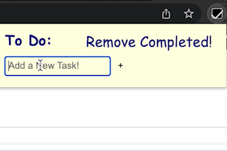
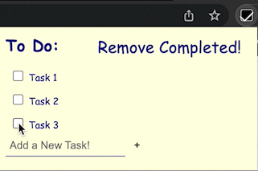

# To Do List Chrome Extension
## About this Project:
This chrome extension offers a user a simple to do list that is accessible anywhere in Google Chrome. The list will persist if windows are changed, or the browser is quit. It is utilizes HTML, CSS, Javascript and Google's Manifest V3 platform and resembles a Post-it note that you may find stuck to many people's monitors. 

This was my first venture into Web Development of any sort. I found it to be a cool challenge, and it was fun to try to develop something I would actually find useful in my day-to-day life. However, as this is my first time trying my hand in front-end web design, the extension is very simple, and I hope to add more functionality and improve the styling in the future!

## Extension in Action:
- Adding tasks to the to do list:

- Deleting tasks from the to do list:

